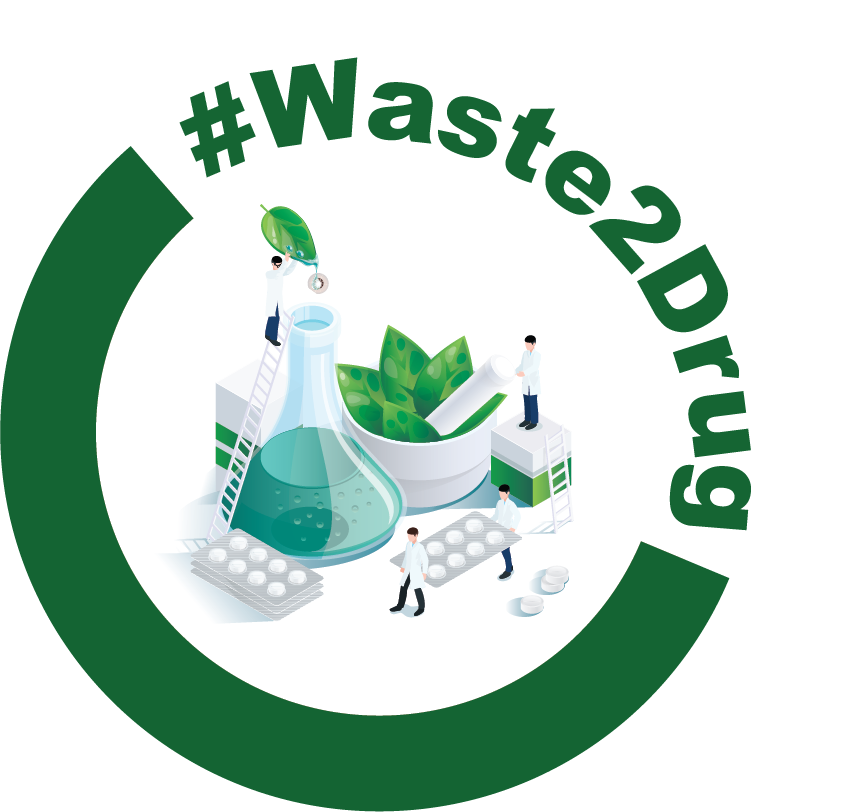
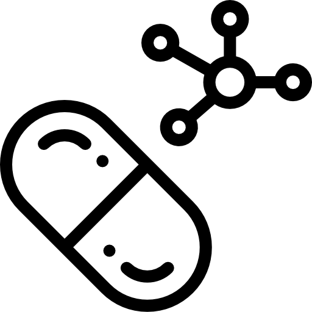

[About the project](./about.html).

# Our Mission
With Waste2Drug, we aim to turn agricultural waste into life-saving opportunities. By transforming natural compounds from agri-waste into powerful anticancer drugs, we aspire to drive innovation at the intersection of sustainability and health. Supported by the [MSCA programme](https://marie-sklodowska-curie-actions.ec.europa.eu/actions/postdoctoral-fellowships), our mission is to build a circular bioeconomy where waste fuels discovery — creating value for people and the planet.

# Our Objectives

  <!-- First item -->
  

    
    

      <strong>Identify the molecular target of p-cymene</strong> 
      Use of reverse docking and Machine Learning (ML) methodologies in order to reveal the molecular target on which p-cymene exerts its anticancer action. Validate the <i>in silico</i> identified target with <i>in vitro</i> experiments.
    

  

  <!-- Second item -->
  

    
    

      <strong>Novel Drug Design</strong> 
      Use the molecular scaffold of p-cymene and its identified target(s) in order to design more potent anti-cancer agents.
    

  

  <!-- Third item (centered below) -->
  

    
    

      <strong>Biomass Valorisation through terpene dehydroaromatization</strong> 
      Computationally unravel the mechanism of terpene dehydroaromatization in order to optimise the access of p-cymene from agri-waste biomass.
    

  

